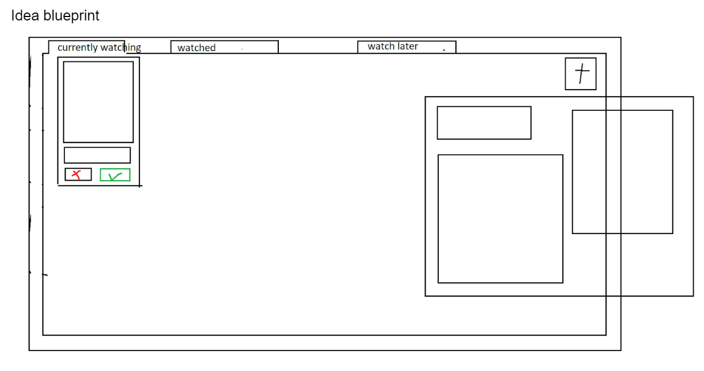

# Customer Notes
## User Story
### Strategy
For TV shows and movie watchers, \
We provide an app to keep track of shows and movies
So that those users will have a place to track what they want to watch, currently \watching, and have watched in one place.
### User Stories:
1. As a show/movie watcher, I would like to add shows/movies to any list, so that I have a different lists of shows/movies I have previously finished, plan to watch or even currently watching.
2. As a show/movie watcher, I would like each show/movie to have an image with it, so that I can quickly and easily identify shows/movies by their image.
3. As a show watcher who finished a show, I would like to have a checkmark button by each show in the "Currently Watching" list that will move said show to the "Watched" list , so that I am able to mark the show as completed.
4. As a show/movie watcher looking for a way to watch a show/movie, I would like to be able to add a link to a saved show/movie that takes me to where said show/movie can be watched.
5. As a movie watcher who finished a movie, I would like to be able to rate said finished movie out of five stars when it moves to the "Watched" list, so that I can note how I liked the movie. 
6. As a show watcher who watches many shows in the same time period, I would like a "Currently Watching" list, so that I can see what shows I have started.
### Acceptance Criteria:
1. As a show/movie watcher, I would like to add shows/movies to any list, so that I have a different lists of shows/movies I have previously finished, plan to watch or even currently watching.
    * The user should have three different list.
    * This should be in the shown when adding a new show/movie.
    * There should be something that lets the user know the show/movie has been added to the specified list.
2. As a show/movie watcher looking for a way to watch a show/movie, I would like to be able to add a link to a saved show/movie that takes me to where said show/movie can be watched.
    * This should be shown when adding a new show/movie.
    * The link space can be left blank.
    * This should be able to be edited at any time.
3. As a show watcher who watches many shows in the same time period, I would like a "Currently Watching" list, so that I can see what shows I have started.
    * This list should be shown when the app is opened.
    * Any show can be deleted/removed.
    * The list should display the shows by the image with the title underneath.

## Design Blueprint
